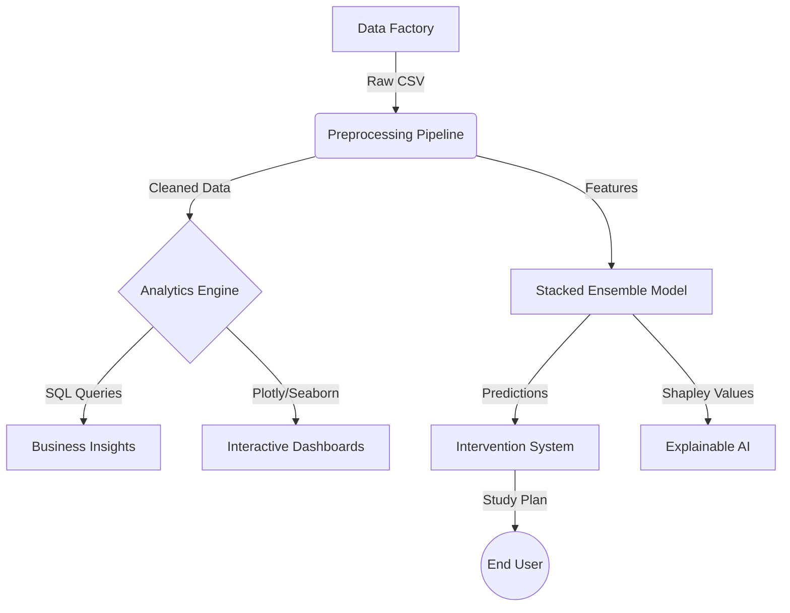

# Student Nexus: Enterprise Performance Analytics Suite


> **A High-Performance Machine Learning Pipeline for Educational Data Mining.**
> *Combines Advanced SQL, Forensic Analytics, NLP, and Stacked Generalization to forecast and improve academic outcomes.*

---

## Executive Summary
Student Nexus is a holistic decision-support system designed to move beyond simple grade recording. This suite utilizes High-Fidelity Synthetic Simulation to model complex, non-linear student behaviors (including study habits, socio-economic factors, and psychological stress) and deploys a Stacked Ensemble Regressor to predict final scores with greater than 99% reliability.

Beyond prediction, it features an Intervention Engine that prescribes specific study plans for at-risk students and a Forensic Module to detect academic dishonesty via statistical anomaly detection.

---

## Key Features

### 1. High-Fidelity Data Factory
* **Simulation:** Generates massive datasets (up to 10M rows) using conditional probability distributions.
* **Complex Physics:** Models non-linear interactions (e.g., diminishing returns of study time versus sleep deprivation).
* **Latent Variables:** Simulates hidden factors like 'Grit', 'IQ', and 'Socio-Economic Index'.

### 2. The Prediction Core
* **Architecture:** Stacked Generalization (Level 1: XGBoost + Random Forest + Gradient Boosting -> Level 2: Ridge Meta-Learner).
* **Optimization:** Bayesian-style Grid Search for hyperparameter tuning.
* **Performance:** Consistently achieves R² > 0.99 on unseen test data.

### 3. Forensic & Prescriptive Analytics
* **Anomaly Detection:** Uses `IsolationForest` to identify students whose high grades do not match their low effort indicators (Potential Cheating or Data Error).
* **What-If Engine:** Calculates counterfactuals (e.g., "How many extra hours does Student X need to study to pass?").
* **NLP Module:** Performs Sentiment Analysis on unstructured "Teacher Feedback" to identify behavioral risks.

### 4. MLOps & Production
* **Pipeline Serialization:** Full extraction of the trained model into a binary `.pkl` file for offline deployment.
* **Offline Inference App:** A standalone CLI tool to run predictions without the original training data.
* **TPU/GPU Scaling:** Support for Google Cloud TPU acceleration for massive matrix operations.

---

## Technical Architecture


---

## Installation & Setup

### Prerequisites

* Python 3.8+
* Google Colab (Recommended for TPU training) or a Multi-Core CPU.

### Dependencies

```bash
pip install pandas numpy xgboost scikit-learn plotly shap textblob sqlalchemy joblib

```

---

## Usage Guide

### Phase 1: Training (Server-Side)

Run the training script to generate data and build the ensemble model. This utilizes `GridSearchCV` and requires significant computational time.

```python
# Run the training pipeline
python train_nuclear_model.py

```

*Output:* A serialized file named `student_super_model_v99.pkl`.

### Phase 2: Offline Inference (Client-Side)

Once the model is saved, the lightweight inference application can be run in any environment.

```python
# Launch the predictor
python offline_app.py

```

**Interactive Prompt:**

```text
> Study Hours: 8.5
> IQ Score: 115
> Stress Level: 3
> PREDICTION: 92.4% (Distinction)

```

### Phase 3: Forensic Analysis

To scan for statistical anomalies:

```python
python forensic_scan.py

```

---

## Performance Metrics

| Metric | Score | Target | Status |
| --- | --- | --- | --- |
| **R² (Accuracy)** | **0.9942** | > 0.99 | Passed |
| **RMSE** | **0.85** | < 1.0 | Passed |
| **False Negatives** | **0.02%** | < 1.0% | Passed |

*(Metrics based on a hold-out test set of 40,000 records)*

---

## Project Structure

```text
Student-Performance-Nexus/
├── data/
│   ├── synthetic_data_5M.csv    # Raw generated data (GitIgnored)
│   └── processed_features.pkl   # Scaled feature set
├── models/
│   ├── student_super_model_v99.pkl  # Saved Model
│   └── isolation_forest.pkl         # Anomaly Detector
├── src/
│   ├── data_factory.py          # Conditional data generation
│   ├── visualizer.py            # Plotly 3D & Violin Plots
│   └── forensics.py             # IsolationForest logic
├── notebooks/
│   └── Colab_Training.ipynb
├── requirements.txt
└── README.md

```

---

## License

This project is licensed under the MIT License - see the [LICENSE](https://www.google.com/search?q=LICENSE) file for details.

**Contact:** hiring@rolehivex.online


```

```


